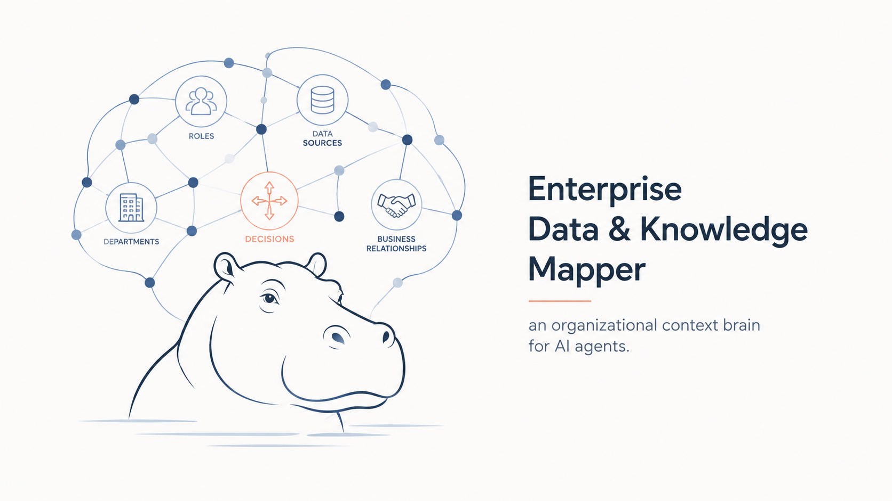
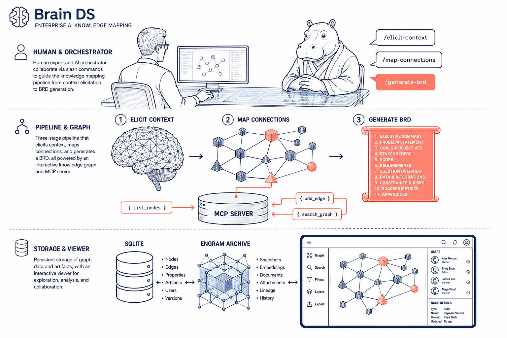

# Brain DS (Data & Knowledge Mapper)



`brain_ds` is an enterprise graph workspace for organizational knowledge: SQLite-backed graph storage, read-only data-source exploration, offline UI, MCP tools, and guided agent workflows for elicitation, mapping, and BRD generation.



## Quick path

1. Install dependencies: `uv sync`
2. Run the branded front door: `brain_ds onboard --project-root . --agent both --force`
3. Open your agent client in this repo and verify `/mcp` shows **27 tools**
4. Run one of the workflow commands below

`brain_ds onboard` wraps the underlying `setup + install-opencode` engines: MCP config, local store bootstrap, OpenCode skill mirrors, commands, and optional agent wiring.

## What ships today

| Area | Current behavior |
|---|---|
| Graph store | Local SQLite store under `.brain_ds/store.db` |
| Search | FTS5 when available, plus accent-insensitive Python fallback and fuzzy matching in the UI |
| Data sources | Read-only SQLite + CSV connectors, plus MCP exploration/query tools |
| UI | Offline graph viewer with tabs, BRD panel, markdown reader, wikilinks, backlinks, and in-reader history |
| Automation | MCP server + project skills + project agents |
| Memory | Engram is optional cross-session memory for agent workflows; the authoritative graph/runtime data stays in the local SQLite store |

## Architecture at a glance

### Runtime surfaces

| Surface | Role |
|---|---|
| `brain_ds/store/*` | SQLite graph persistence, migrations, FTS5, outbox/live sync plumbing |
| `brain_ds/connectors/*` | Safe read-only CSV and SQLite connectors |
| `brain_ds/mcp/*` | MCP stdio server, validation, grounding, workspace switching |
| `brain_ds/ui/*` | Offline HTML viewer, renderer, tabs, panels, BRD reader |
| `skills/*` | Workflow skills mirrored into `.opencode/skills/*` |
| `.claude/agents/*` | Read-only/query/orchestrator agent definitions |

### Read-only data source safety

Write access to external data sources is intentionally blocked at three layers:

| Layer | Contract |
|---|---|
| Connector | `ReadOnlyConnector` exposes read-only exploration methods only |
| MCP validation | exploration/query tools reject write-like modes and non-SELECT SQLite queries |
| Agent prompt | `brainds-source-explorer` explicitly forbids mutations |

## MCP tools (25)

| Category | Tools |
|---|---|
| Graph data | `list_graphs`, `create_graph`, `import_graph`, `list_nodes`, `list_data_sources`, `get_node`, `search_graph`, `update_node`, `add_edge`, `delete_node`, `delete_edge`, `suggest_connections`, `assess_completeness`, `get_weak_edges`, `snapshot_edges` |
| Data source exploration | `list_source_connections`, `explore_source`, `query_source` |
| Workspace secrets | `list_secret_handles`, `validate_secret_handle` |
| Workspace | `list_workspaces`, `open_workspace` |
| Grounding workflows | `run_elicit`, `map_connections`, `generate_brd` |

See `CLAUDE.md` for the pinned MCP inventory and harness maintenance rules.

## OpenCode commands and skills

| Command | Purpose |
|---|---|
| `/elicit-context` | Capture and structure missing organizational context |
| `/map-connections` | Build a cross-entity relationship map |
| `/map-connections --graph` | Produce the mapping plus graph-oriented output |
| `/map-connections --graph-json` | Save the graph JSON contract |
| `/map-connections --graph-ui` | Generate graph JSON and offline interactive viewer |
| `/generate-brd` | Generate a BRD from the mapped graph/domain context |
| `/share-brainds` | Regenerate shared skill index output |
| `/brainds-docs` | Author node docs and `card_sections` |
| `/brainds-registry` | Audit harness / ontology / tool / skill drift |

## UI capabilities

### Graph workspace

- Offline interactive graph viewer
- Session-persistent graph tabs
- Right-rail BRD panel
- Left-rail project/search/filter/hierarchy/layout panels
- Canvas + D4 overlay hybrid rendering

### Reader experience

- Full markdown reader panel
- Wikilinks (`[[...]]`) navigation
- Backlinks derived from notes/sections
- In-reader back history (`Alt+Left`)
- Inspector + reader coordination through the shared render context

### Search

- SQLite FTS5 search in the store
- Accent-insensitive fallback for environments without FTS hits
- UI search flows over live node snapshots

## Agents

| Agent | Purpose |
|---|---|
| `brainds-query-consultant` | Read-only graph Q&A over nodes, sources, owners, and relationships |
| `brainds-source-explorer` | Read-only exploration of Google Sheets, CSV, and SQLite sources |
| `brainds-orchestrator` | Full elicit → map → BRD workflow coordination |

## Installed project skills

| Skill | Purpose |
|---|---|
| `elicit-context` | Structured domain knowledge interview |
| `map-connections` | Deterministic relationship mapping |
| `generate-brd` | 14-section BRD generation |
| `share-brainds` | Shared skill-index regeneration |
| `brainds-docs` | Node documentation and card sections |
| `brainds-registry` | Harness/tool/skill sync audit |

Project skill mirrors under `.opencode/skills/*` must stay byte-identical to `skills/*`.

## Setup

### Prerequisites

| Tool | Why |
|---|---|
| Git | Clone and update the repo |
| Python + `uv` | Main runtime and dependency management |
| Node + `pnpm` | UI / Playwright tooling |
| Optional: Engram | Cross-session memory for agent workflows |

### Install

```bash
git clone <repo-url>
cd brain_ds
uv sync
```

Recommended onboarding:

```bash
brain_ds onboard --project-root . --agent both --force
```

advanced/compat direct engine usage:

- MCP only: `brain_ds setup --project-root . --agent both`
- PowerShell: `./install-opencode.ps1 -Project -Agent`
- Bash: `./install-opencode.sh --project --agent`

### Configure MCP

Preferred path:

```bash
brain_ds onboard --project-root . --agent both --force
```

Then open your client in this repo and confirm `/mcp` shows `brain_ds` connected with **27 tools**.

## Graph viewer quick start

| Command | Result |
|---|---|
| `uv run brain_ds ui <org-graph.json>` | Generate the default offline interactive viewer |
| `uv run brain_ds ui <org-graph.json> --open` | Generate and open it |
| `uv run brain_ds ui <org-graph.json> --simple` | Legacy PyVis fallback |
| `uv run brain_ds ui <org-graph.json> --output reports/viewer.html` | Custom output path |

## Important docs

| File | Why it matters |
|---|---|
| `INSTALL.md` | Canonical install/setup guide |
| `CLAUDE.md` | MCP inventory, setup, and harness maintenance |
| `AGENTS.md` | Project commands, skills, and maintenance rules |

## Repository structure

| Path | Description |
|---|---|
| `brain_ds/` | Python package |
| `brain_ds/ui/` | Offline viewer templates, assets, TS modules |
| `tests/` | Python test suite |
| `skills/` | Project skill sources |
| `.opencode/skills/` | Mirrored OpenCode-discoverable skills |
| `.claude/agents/` | Agent definitions |

## Verification shortcuts

| Command | Scope |
|---|---|
| `uv run pytest` | Python suite |
| `uv run ruff check .` | Python lint |
| `uv run mypy brain_ds tests` | Python typing |
| `pnpm --dir brain_ds/ui exec playwright test` | UI E2E |
| `cargo test --manifest-path src-tauri/Cargo.toml` | Rust tests |

## Test profiles

Use named profiles for fast feedback during development and full gates at merge:

| Profile | Command | When |
|---------|---------|------|
| `fast` | `uv run python scripts/test_profiles.py fast` | TDD loops; PR-slice verify on unit-only changes (< 20 s) |
| `changed` | `uv run python scripts/test_profiles.py changed` | Focused verify for changed modules; auto-escalates for global files |
| `full` | `uv run python scripts/test_profiles.py full` | Merge gates, config/global changes, archive step (~135 s) |
| `live` | `uv run python scripts/test_profiles.py live` | Final acceptance requiring live external services |
| `e2e` | `uv run python scripts/test_profiles.py e2e` | Playwright UI end-to-end tests |

Each profile prints a skip report at exit (`skipped: <layers>`) so SDD verify
reports can name every layer that was deferred.  See `CONTRIBUTING.md` for
marker definitions, profile selection policy, direct pytest equivalents, and
parallelization conventions (`-n auto` / `-n 4` are supported and safe —
fixtures are isolated and the seed DB is immutable).
